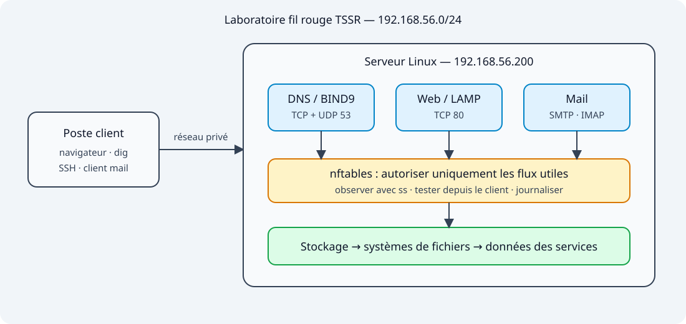

# Formation — Linux : Bases & Services

<section class="network-hero">
  

    Formation TSSR · laboratoire fil rouge
    <h2>Administrer Linux. Démontrer chaque diagnostic.</h2>
    
Du stockage aux services réseau : cours détaillés, schémas SVG, travaux pratiques et pannes guidées pour apprendre à observer, expliquer et rétablir.

    

      <a class="network-button network-button--primary" href="./00-mise-en-place/">Commencer le parcours →</a>
      <a class="network-button network-button--ghost" href="./Ressources/fiche-diagnostic-tssr">Ouvrir la méthode TSSR ↗</a>
    

    

      <strong>15</strong> cours
      <strong>10</strong> TP
      <strong>16</strong> schémas SVG
    

  

  

    
    <i aria-hidden="true"></i> Laboratoire documenté
  

</section>

## Explorer la formation

  <a class="learning-card learning-card--blue" href="./00-mise-en-place/">
    00Préparation
    <strong>Mise en place</strong>Infrastructure, réseau privé et objectifs du laboratoire.
  </a>
  <a class="learning-card learning-card--orange" href="./01-stockage/">
    01Données
    <strong>Gestion du stockage</strong>Partitions, LVM, systèmes de fichiers et montages persistants.
  </a>
  <a class="learning-card learning-card--cyan" href="./02-administration-systeme/">
    02Système
    <strong>Administration Linux</strong>Démarrage, matériel, processus, systemd, logs et performances.
  </a>
  <a class="learning-card learning-card--violet" href="./03-dns-bind9/">
    03Résolution
    <strong>DNS avec BIND9</strong>Zone autoritaire, transfert, enregistrements et diagnostic avec dig.
  </a>
  <a class="learning-card learning-card--green" href="./04-serveur-web-lamp/">
    04Application
    <strong>Serveur Web LAMP</strong>Apache, virtual hosts, PHP, MariaDB et tests par couche.
  </a>
  <a class="learning-card learning-card--red" href="./05-pare-feu-nftables/">
    05Protection
    <strong>Pare-feu nftables</strong>Chaînes, état de connexion, règles persistantes et compteurs.
  </a>
  <a class="learning-card learning-card--rose" href="./06-messagerie/">
    06Service complet
    <strong>Messagerie</strong>Postfix, Maildir, Dovecot, IMAP et suivi d'un message.
  </a>

## Apprendre en manipulant

  <a class="experience-card experience-card--game" href="./Ressources/fiche-diagnostic-tssr">
    ⌕Méthode terrain
    <strong>Diagnostiquer sans deviner</strong>Partir du symptôme, vérifier chaque couche et produire une preuve.<b>Ouvrir la fiche →</b>
  </a>
  <a class="experience-card experience-card--revision" href="./01-stockage/tp/01-stockage">
    >_Premier laboratoire
    <strong>Manipuler LVM</strong>Étendre la capacité, rendre le montage persistant et diagnostiquer fstab.<b>Commencer le TP →</b>
  </a>

## Emporter la formation

  
⬇

  
<strong>Emporter le support publié</strong>Cours Markdown, TP et illustrations SVG, sans les fichiers techniques de Quartz.

  <a class="obsidian-download__button" href="./linux-bases-services-obsidian.zip" download>Télécharger le ZIP</a>

  <a href="./Ressources/">Toutes les ressources →</a>
  <a href="https://github.com/kayasam/linux-bases-services">Dépôt GitHub ↗</a>

